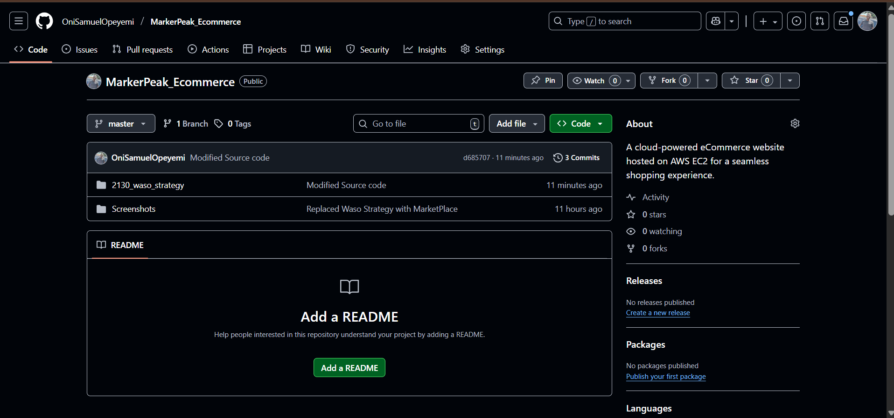
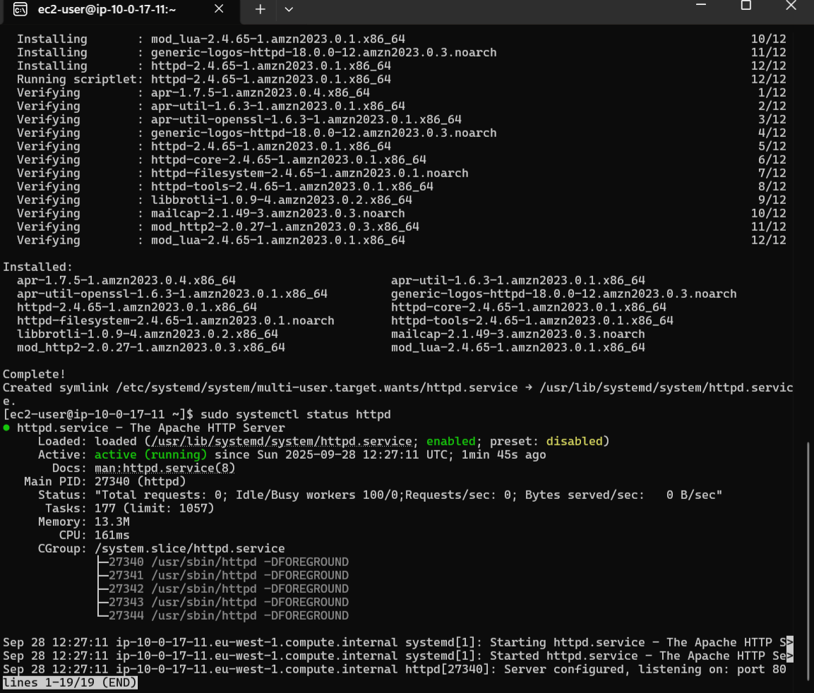
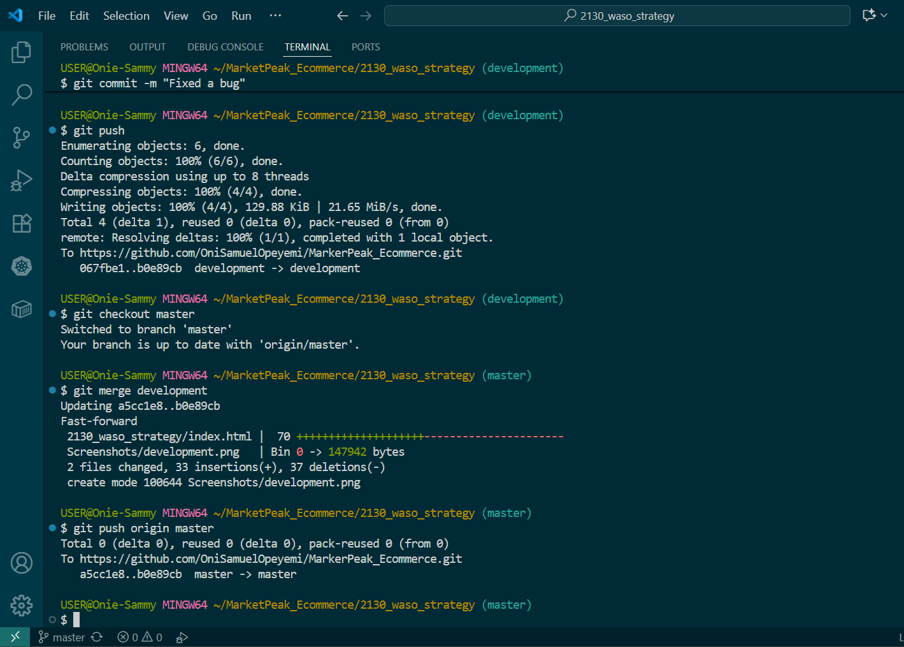

# 🛒 MarkerPeak E-commerce Deployment

MarketPeak is a modern, cloud-powered **eCommerce platform** hosted on **AWS EC2**.  
This project demonstrates how to manage code with Git, deploy on a Linux server, configure Apache web server, and set up a **CI/CD pipeline** for continuous integration and delivery.

---

## 🚀 Project Objectives

1. Implement version control using **Git**.  
2. Deploy the website on an **AWS EC2 Linux server**.  
3. Configure **Apache (httpd)** and **nginx** to serve the eCommerce site.  
4. Enable seamless access to the website from a browser.  
5. Establish a **CI/CD workflow** for continuous deployment.  
6. Document **troubleshooting steps** for common issues.  

---

## 🛠️ Tech Stack

- **Version Control**: Git + GitHub  
- **Cloud Provider**: AWS (EC2)  
- **Web Server**: Apache httpd, nginx (web server and reverse proxy)  
- **OS**: Linux (Amazon Linux 2 / Ubuntu)  
- **CI/CD**: GitHub Actions
- **Domain record**: duck DNS
- **SSL certification**: certbot certification
- **Deployment**: SSH + Git pull

---

## 📂 Project Structure

```
MarketPeak/
│── index.html
│── about.html
│── contact.html
│── assets/
│   ├── css/
│   ├── js/
│   └── images/
│── README.md
|── Screenshot/
```

---

## 📝 Deployment Steps

### 1. Implement Version Control
```bash
# Initialize a new Git repository
git init

# Add files to staging
git add .

# Commit changes
git commit -m "Initial commit - MarketPeak Website"

# Link remote repository (replace with your repo URL)
git remote add origin git@github.com:username/MarketPeak.git

# Push to GitHub
git push -u origin main
```




---

### 2. Set Up AWS EC2 Instance
1. Log in to the **AWS Management Console**.  
2. Navigate to **EC2 Dashboard** → **Launch Instance**.  
3. Select **Amazon Linux 2** or **Ubuntu 20.04**.  
4. Choose **t2.micro** (free tier).  
5. Configure **Security Group**:
   - Allow **SSH (22)** from your IP.  
   - Allow **HTTP (80)** from Anywhere.  
6. Launch and download your **Key Pair (.pem)**.  


---

### 3. Connect to EC2 via SSH
```bash
# Set key permission
chmod 400 marketpeak-key.pem

# Connect to instance
ssh -i marketpeak-key.pem ec2-user@<EC2-Public-IP>
```


---

### 4. Clone Repo on EC2
```bash
# Install Git
sudo yum install git -y   # Amazon Linux
# or
sudo apt-get install git -y  # Ubuntu

# Clone using SSH
git clone git@github.com:username/MarketPeak.git

cd MarketPeak
```

---

### 5. Install Apache Web Server
```bash
# Install Apache
sudo yum install httpd -y   # Amazon Linux
# or
sudo apt-get install apache2 -y  # Ubuntu

# Start service
sudo systemctl start httpd
sudo systemctl enable httpd
```


---

### 6. Deploy Website on Apache
```bash
# Copy website files to Apache root directory
sudo cp -r * /var/www/html/

# Restart Apache
sudo systemctl restart httpd
```

Now, open **http://<EC2-Public-IP>** in your browser. 🎉


---

### 7. Continuous Integration & Deployment (CI/CD)

Use **GitHub Actions** for automated deployments.

`.github/workflows/main.yml`:
```yaml
name: Deploy to EC2

on:
  workflow_dispatch:
  pull_request:
    branches:
      - master
  push:
    branches:
      - master
      - development

jobs:
  deploy:
    runs-on: ubuntu-latest

    steps:
    - name: Checkout code
      uses: actions/checkout@v3

    - name: Deploy to EC2
      uses: appleboy/ssh-action@v0.1.7
      with:
        host: ${{ secrets.EC2_IP }}
        username: ec2-user
        key: ${{ secrets.EC2_SSH_KEY }}
        debug: true
        script: |
          # 1. Pull the latest code to a temp directory
          rm -rf ~/deploy_temp

          # Use HTTPS clone so no SSH key is required on the runner/EC2 for cloning public repos
          git clone https://github.com/OniSamuelOpeyemi/MarkerPeak_Ecommerce.git ~/deploy_temp
          cd ~/deploy_temp || exit 1

          # 2. Remove all contents inside /usr/share/nginx/html
          sudo rm -rf /usr/share/nginx/html/*

          # 3. Copy new files from the subfolder to the nginx html directory
          sudo cp -r ~/deploy_temp/2130_waso_strategy/* /usr/share/nginx/html/

          # 4. Clean up temp directory
          rm -rf ~/deploy_temp

          # 5. Restart nginx
          sudo systemctl restart nginx
```




---
# 🌐 Nginx Reverse Proxy Setup with DuckDNS & SSL (Certbot)

After switching from **Apache** to **Nginx**, MarketPeak is now served using a reverse proxy, secured with **Let's Encrypt SSL** via **Certbot**.  
Below are the deployment steps:

---

## 1. Install Nginx
```bash
# On Amazon Linux / CentOS
sudo yum install nginx -y

# On Ubuntu / Debian
sudo apt-get update
sudo apt-get install nginx -y

# Enable and start nginx
sudo systemctl enable nginx
sudo systemctl start nginx
```

---

## 2. Configure DuckDNS Domain
1. Go to [DuckDNS](https://www.duckdns.org) and register/login.  
2. Create a subdomain, e.g. `marketpeak.duckdns.org`.  
3. Point your EC2 public IP to the subdomain in DuckDNS.  
4. Verify DNS is working:
   ```bash
   ping marketpeak.duckdns.org
   ```

---

## 3. Configure Nginx as Reverse Proxy
Edit the default configuration (or create a new one for MarketPeak):

```bash
sudo nano /etc/nginx/sites-available/marketpeak
```

Paste the following configuration:
```nginx
server {
    listen 80;
    server_name marketpeak.duckdns.org;

    location / {
        root /usr/share/nginx/html;
        index index.html index.htm;
        try_files $uri $uri/ =404;
    }
}
```

Enable configuration:
```bash
# For Ubuntu/Debian
sudo ln -s /etc/nginx/sites-available/marketpeak /etc/nginx/sites-enabled/

# Test config
sudo nginx -t

# Reload nginx
sudo systemctl reload nginx
```

Now your site should be available at **http://marketpeak.duckdns.org**

---

## 4. Install Certbot & Enable HTTPS
Install Certbot (Let's Encrypt client):

```bash
# On Amazon Linux 2
sudo amazon-linux-extras enable epel
sudo yum install certbot python3-certbot-nginx -y

# On Ubuntu
sudo apt-get install certbot python3-certbot-nginx -y
```

Obtain SSL certificate:
```bash
sudo certbot --nginx -d marketpeak.duckdns.org
```

Follow the prompts:
- Enter your email  
- Agree to terms  
- Redirect HTTP → HTTPS (recommended)  

---

## 5. Verify SSL Renewal
Certbot automatically installs a cron job. To test:
```bash
sudo certbot renew --dry-run
```

---

## 6. Final Nginx Configuration (HTTPS Enabled)

```nginx
server {
    listen 80;
    server_name marketpeak.duckdns.org;
    return 301 https://$host$request_uri;
}

server {
    listen 443 ssl;
    server_name marketpeak.duckdns.org;

    ssl_certificate /etc/letsencrypt/live/marketpeak.duckdns.org/fullchain.pem;
    ssl_certificate_key /etc/letsencrypt/live/marketpeak.duckdns.org/privkey.pem;
    include /etc/letsencrypt/options-ssl-nginx.conf;
    ssl_dhparam /etc/letsencrypt/ssl-dhparams.pem;

    location / {
        root /usr/share/nginx/html;
        index index.html index.htm;
        try_files $uri $uri/ =404;
    }
}
```

Reload Nginx:
```bash
sudo nginx -t
sudo systemctl reload nginx
```

---

## 7. Access Your Website

- Visit: **https://marketpeak.duckdns.org**  
- SSL certificate is active (green lock 🔒).  
- Your site is now secured and production-ready!  


---

## 🛠️ Troubleshooting

| Issue | Possible Cause | Fix |
|-------|----------------|-----|
| **Permission denied (publickey)** | Wrong SSH key / not added to GitHub | Run `ssh-add ~/.ssh/id_rsa` and check repo SSH key |
| **Apache not starting** | Port 80 in use or misconfig | Run `sudo lsof -i:80`, restart service |
| **Website not loading** | Security Group misconfigured | Allow inbound HTTP 80 in EC2 Security Group |
| **Changes not reflecting** | Cache or outdated files | Run `git pull` and `sudo systemctl restart httpd` |
| **403 Forbidden** | File permissions issue | Run `sudo chown -R apache:apache /var/www/html` |
---

## 🆘 Troubleshooting & Operational Notes

This section collects the practical fixes and lessons learned while deploying MarketPeak on EC2 with Nginx/Apache and GitHub Actions.

### SSH access and deploy keys

- If you get "Permission denied (publickey)" when the GitHub Action or `ssh` fails, ensure the private key used by the action matches a public key present in `/home/<user>/.ssh/authorized_keys` on the EC2 instance.
- Recommended local key generation (on your secure admin machine):

```bash
ssh-keygen -t rsa -b 4096 -C "deploy@marketpeak" -f ~/markerpeak_deploy_key
```

- Secure the private key (do not commit):
```bash
chmod 600 ~/markerpeak_deploy_key
```

- Install the public key on EC2 (either via existing SSH session or AWS Session Manager):
```bash
# On your local machine
scp -i /path/to/old_key.pem ~/markerpeak_deploy_key.pub ec2-user@EC2_IP:~/markerpeak_deploy_key.pub
# On EC2
cat ~/markerpeak_deploy_key.pub >> ~/.ssh/authorized_keys
rm ~/markerpeak_deploy_key.pub
chmod 600 ~/.ssh/authorized_keys
chmod 700 ~/.ssh
chown -R ec2-user:ec2-user ~/.ssh
```

- If the `authorized_keys` file doesn't exist (fresh instance), create it safely on the instance:
```bash
mkdir -p ~/.ssh
chmod 700 ~/.ssh
touch ~/.ssh/authorized_keys
chmod 600 ~/.ssh/authorized_keys
```

### Adding the private key to GitHub Actions secrets

- Copy the private key content and save it as a repository secret named `EC2_SSH_KEY` (Settings → Secrets and variables → Actions → New repository secret).
- If your key has a passphrase, store it as `EC2_SSH_PASSPHRASE` and pass it to the action inputs.
- Example `gh` CLI command to set the secret (requires GH CLI and an authenticated session):
```bash
gh secret set EC2_SSH_KEY --body "$(sed -e ':a' -e 'N' -e '$!ba' -e 's/"/\\"/g' ~/markerpeak_deploy_key)"
```

### Nginx 403 Forbidden — checklist

If your site returns `403 Forbidden` with Nginx and the configuration you've posted, follow these steps in order:

1. Check the Nginx error log for the precise reason:
```bash
sudo tail -n 200 /var/log/nginx/error.log
```

2. Verify the site root has an index file (index.html):
```bash
ls -la /usr/share/nginx/html
echo '<h1>It works</h1>' | sudo tee /usr/share/nginx/html/index.html
sudo chmod 644 /usr/share/nginx/html/index.html
```

3. Ensure permissions and ownership allow the `nginx` worker to read files (typical permissions: dirs 755, files 644):
```bash
sudo find /usr/share/nginx/html -type d -exec chmod 755 {} \;
sudo find /usr/share/nginx/html -type f -exec chmod 644 {} \;
sudo chown -R root:root /usr/share/nginx/html
```

4. If SELinux is enabled, restore proper contexts:
```bash
getenforce || echo 'SELinux check not available'
sudo restorecon -Rv /usr/share/nginx/html
```

5. Make sure your Nginx config includes an `index` directive (add inside the `server` block):
```
index index.html index.htm;
```

6. Test and reload Nginx:
```bash
sudo nginx -t
sudo systemctl reload nginx
```

### CI/CD action notes and gotchas

- Use HTTPS clone inside the remote script when the server/runner does not have a deploy key or GitHub SSH access.
- When using `appleboy/ssh-action`, ensure the runner-side secrets exist:
  - `EC2_IP` — public IP or DNS of your EC2 instance
  - `EC2_SSH_KEY` — the private key text
  - optionally `EC2_SSH_PASSPHRASE`
- Add `debug: true` to the action `with:` to get verbose logs during debugging.
- To validate the EC2 host key, you can use the action's `fingerprint` input (preferred for security). Use `ssh-keyscan` to retrieve the host key fingerprint.

Example host key scan:
```bash
ssh-keyscan -t rsa EC2_IP >> /tmp/hostkey.pub
ssh-keygen -lf /tmp/hostkey.pub
```

### Recovery if you are locked out of SSH

If you cannot connect by SSH and need to fix `/home/ec2-user/.ssh/authorized_keys`:

1. Use the AWS Console → EC2 → Instances → Select instance → Connect → Session Manager to get a shell.
2. Create the `.ssh` folder and paste your public key into `authorized_keys` (see commands above).
3. Ensure correct permissions and ownership.

### Quick verification commands

- Test SSH with verbose logging from your admin machine:
```bash
ssh -i ~/markerpeak_deploy_key ec2-user@EC2_IP -v
```

- Test a simple curl request to the server (HTTP):
```bash
curl -I http://marketpeak.duckdns.org/
```

### Security & operational best practices

- Don't commit private keys to the repository. Use GitHub Secrets.
- Rotate deploy keys periodically and remove old keys from `authorized_keys`.
- Limit SSH Security Group rules to your admin IP for management; keep HTTP/HTTPS open to the world as needed.
- Use AWS Systems Manager Session Manager as a safer alternative to open SSH in production.

---
