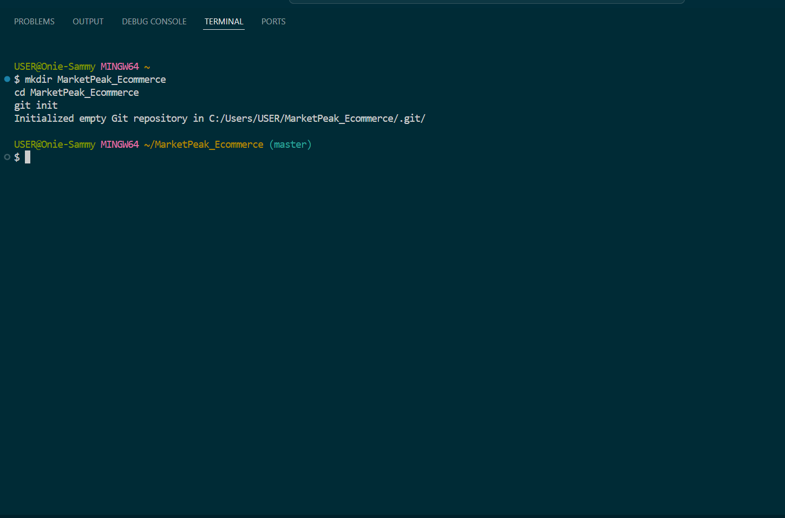
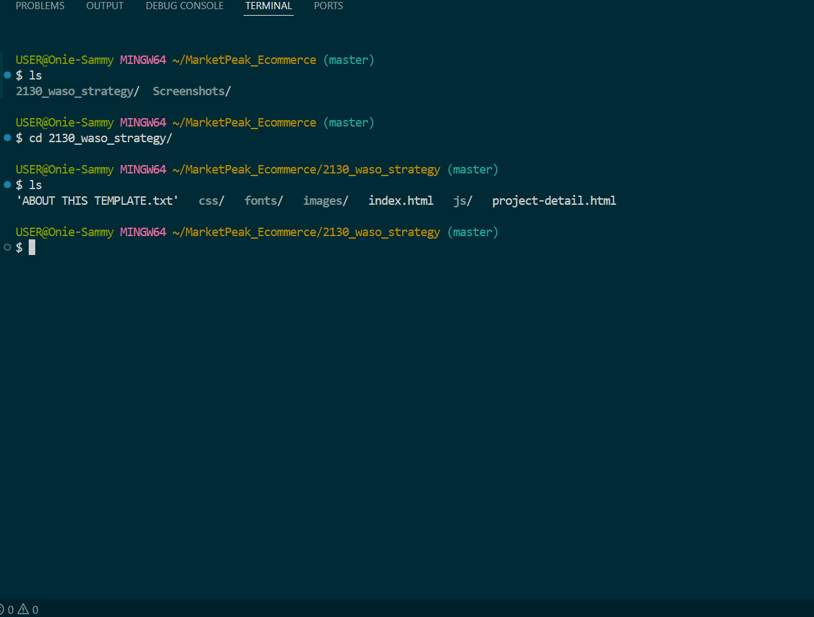
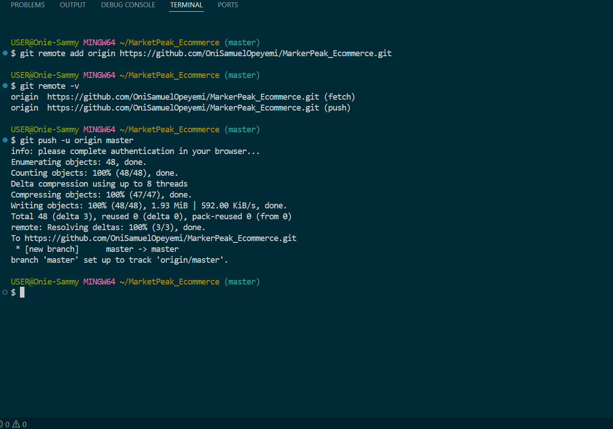
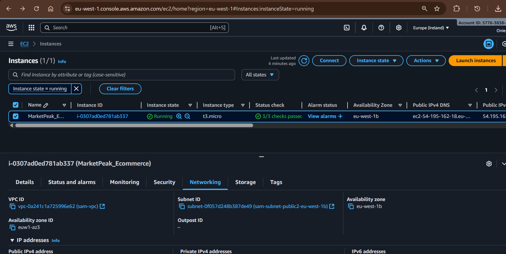
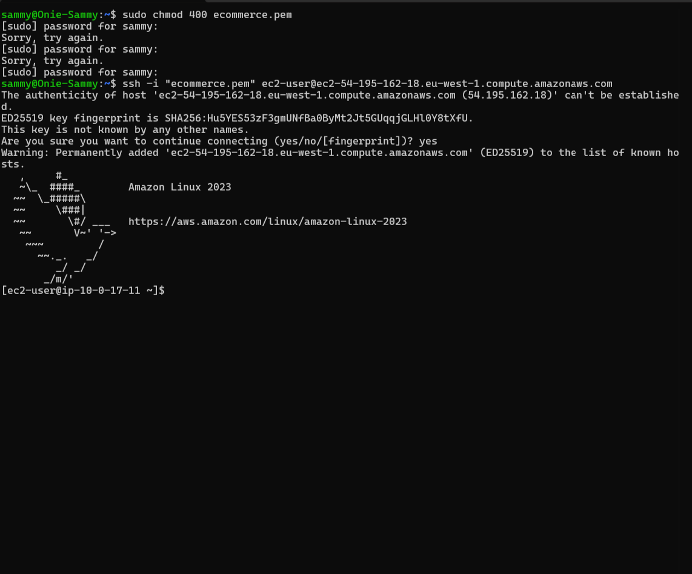
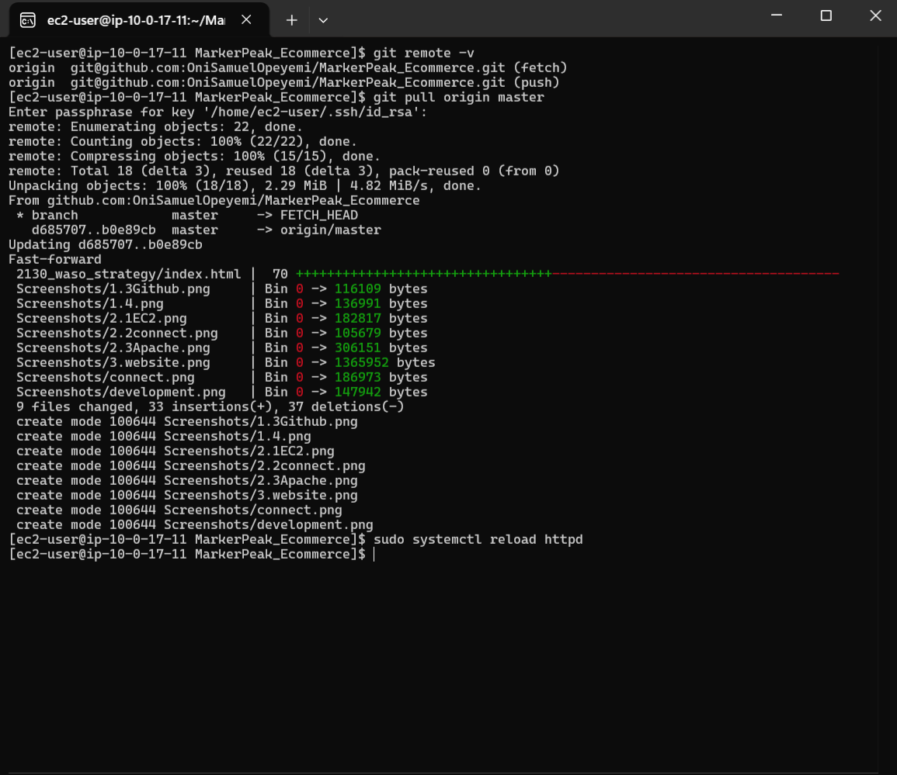
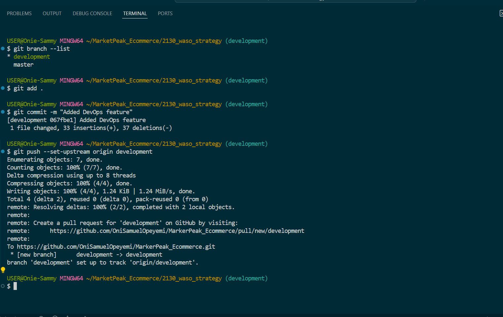

# 🛒 MarketPeak E-commerce Deployment

MarketPeak is a modern, cloud-powered **eCommerce platform** hosted on **AWS EC2**.  
This project demonstrates how to manage code with Git, deploy on a Linux server, configure Apache web server, and set up a **CI/CD pipeline** for continuous integration and delivery.

---

## 🚀 Project Objectives

1. Implement version control using **Git**.  
2. Deploy the website on an **AWS EC2 Linux server**.  
3. Configure **Apache (httpd)** to serve the eCommerce site.  
4. Enable seamless access to the website from a browser.  
5. Establish a **CI/CD workflow** for continuous deployment.  
6. Document **troubleshooting steps** for common issues.  

---

## 🛠️ Tech Stack

- **Version Control**: Git + GitHub  
- **Cloud Provider**: AWS (EC2)  
- **Web Server**: Apache httpd  
- **OS**: Linux (Amazon Linux 2 / Ubuntu)  
- **CI/CD**: GitHub Actions  
- **Deployment**: SSH + Git pull  

---

## 📂 Project Structure

```
MarketPeak/
│── index.html
│── about.html
│── contact.html
│── assets/
│   ├── css/
│   ├── js/
│   └── images/
│── README.md
|── Screenshot/
```

---

## 📝 Deployment Steps

### 1. Implement Version Control
```bash
# Initialize a new Git repository
git init

# Add files to staging
git add .

# Commit changes
git commit -m "Initial commit - MarketPeak Website"

# Link remote repository (replace with your repo URL)
git remote add origin git@github.com:username/MarketPeak.git

# Push to GitHub
git push -u origin main
```







---

### 2. Set Up AWS EC2 Instance
1. Log in to the **AWS Management Console**.  
2. Navigate to **EC2 Dashboard** → **Launch Instance**.  
3. Select **Amazon Linux 2** or **Ubuntu 20.04**.  
4. Choose **t2.micro** (free tier).  
5. Configure **Security Group**:
   - Allow **SSH (22)** from your IP.  
   - Allow **HTTP (80)** from Anywhere.  
6. Launch and download your **Key Pair (.pem)**.  



---

### 3. Connect to EC2 via SSH
```bash
# Set key permission
chmod 400 marketpeak-key.pem

# Connect to instance
ssh -i marketpeak-key.pem ec2-user@<EC2-Public-IP>
```


---

### 4. Clone Repo on EC2
```bash
# Install Git
sudo yum install git -y   # Amazon Linux
# or
sudo apt-get install git -y  # Ubuntu

# Clone using SSH
git clone git@github.com:username/MarketPeak.git

cd MarketPeak
```

---

### 5. Install Apache Web Server
```bash
# Install Apache
sudo yum install httpd -y   # Amazon Linux
# or
sudo apt-get install apache2 -y  # Ubuntu

# Start service
sudo systemctl start httpd
sudo systemctl enable httpd
```


---

### 6. Deploy Website on Apache
```bash
# Copy website files to Apache root directory
sudo cp -r * /var/www/html/

# Restart Apache
sudo systemctl restart httpd
```

Now, open **http://<EC2-Public-IP>** in your browser. 🎉


---

### 7. Continuous Integration & Deployment (CI/CD)

Use **GitHub Actions** for automated deployments.

`.github/workflows/main.yml`:
```yaml
name: Deploy to EC2

on:
  workflow_dispatch:
  pull_request: 
    branches:
      - master
  push:
    branches:
      - master

jobs:
  deploy:
    runs-on: ubuntu-latest

    steps:
    - name: Checkout code
      uses: actions/checkout@v3

    - name: Deploy to EC2
      uses: appleboy/ssh-action@v0.1.7
      with:
        host: ${{ secrets.EC2_IP }}
        username: ec2-user
        key: ${{ secrets.EC2_SSH_KEY }}
        script: |
          # 1. Pull the latest code to a temp directory
          rm -rf ~/deploy_temp

          git clone https://github.com/OniSamuelOpeyemi/MarkerPeak_Ecommerce.git ~/deploy_temp
          cd ~/deploy_temp
          git init

          # 2. Remove all contents inside /var/www/html but not the folder itself
          sudo rm -rf /var/www/html/*

          # 3. Copy new files from the subfolder to /var/www/html
          sudo cp -r ~/deploy_temp/2130_waso_strategy/* /var/www/html/

          # 4. (Optional) Clean up temp directory
          rm -rf ~/deploy_temp
          sudo systemctl restart httpd
```




---

## 🛠️ Troubleshooting

| Issue | Possible Cause | Fix |
|-------|----------------|-----|
| **Permission denied (publickey)** | Wrong SSH key / not added to GitHub | Run `ssh-add ~/.ssh/id_rsa` and check repo SSH key |
| **Apache not starting** | Port 80 in use or misconfig | Run `sudo lsof -i:80`, restart service |
| **Website not loading** | Security Group misconfigured | Allow inbound HTTP 80 in EC2 Security Group |
| **Changes not reflecting** | Cache or outdated files | Run `git pull` and `sudo systemctl restart httpd` |
| **403 Forbidden** | File permissions issue | Run `sudo chown -R apache:apache /var/www/html` |
